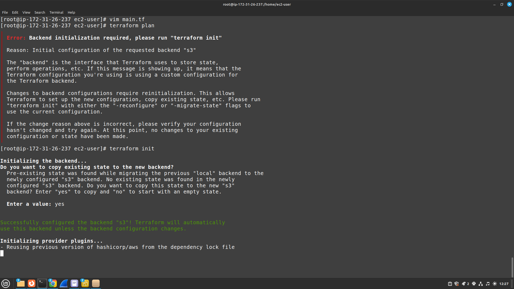
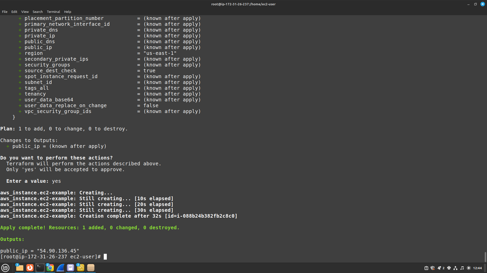
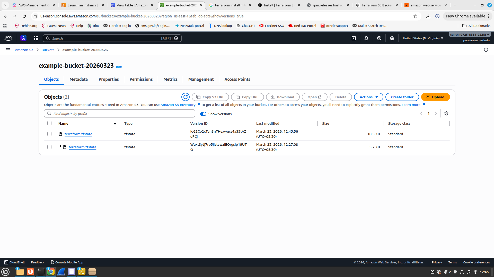

#  Terraform Remote Backend with AWS S3 & DynamoDB

## Outputs

### 🔹 Backend Initialization


---

### 🔹 Terraform Apply Output


---

### 🔹 State File Stored in S3


---

## Project Overview

This project demonstrates how to configure a **Terraform Remote Backend** using:

*  **Amazon S3** → Stores Terraform state file (`terraform.tfstate`)
*  **Amazon DynamoDB** → Provides state locking mechanism
*  **AWS EC2** → Sample resource to validate setup

---

## Why This Project?

In real-world DevOps environments:

 Local state is not safe
 Teams cannot collaborate properly
 Risk of state corruption

 This project solves those problems using:

* Centralized state (S3)
* Locking mechanism (DynamoDB)

---

##  Key Concepts Learned

### 🔹 Terraform State

* Tracks infrastructure created by Terraform
* Default → stored locally (`terraform.tfstate`)
* Remote backend → stored in S3

---

### 🔹 Remote Backend

* Centralized storage for state file
* Enables team collaboration
* Prevents duplication and conflicts

---

### 🔹 S3 (State Storage)

* Stores `.tfstate` file
* Versioning enabled for recovery
* Acts as **source of truth**

---

### 🔹 DynamoDB (State Locking)

* Prevents multiple users running Terraform simultaneously
* Ensures **only one operation at a time**
* Avoids state corruption

---

##  Architecture

```text
Terraform CLI
     ↓
DynamoDB (Lock)
     ↓
S3 (State Storage)
     ↓
AWS Resources (EC2)
```

---

##  Project Structure

```bash
terraform/
├── backend-infra/        # S3 + DynamoDB setup
│   ├── main.tf
│   ├── provider.tf
│   └── outputs.tf
│
└── ec2-project/          # Actual infrastructure
    ├── backend.tf
    ├── main.tf
    ├── provider.tf
    └── outputs.tf
```

---

##  Backend Configuration

```hcl
terraform {
  backend "s3" {
    bucket         = "example-bucket-20260323"
    key            = "project-ec2/terraform.tfstate"
    region         = "us-east-1"
    dynamodb_table = "terraform-locks"
    encrypt        = true
  }
}
```

---

##  Sample Resource (EC2)

```hcl
resource "aws_instance" "ec2_example" {
  ami           = "ami-02dfbd4ff395f2a1b"
  instance_type = "t2.micro"
}

output "public_ip" {
  value = aws_instance.ec2_example.public_ip
}
```

---

##  Commands Used

```bash
terraform init
terraform plan
terraform apply
terraform destroy
```

---

##  State File Verification (S3)

```bash
aws s3 cp s3://example-bucket-20260323/project-ec2/terraform.tfstate -
```

---

##  Common Issues Faced

###  Backend Initialization Required

```bash
terraform init -reconfigure
```

---

###  S3 Bucket Not Empty

* Delete all objects and versions before deleting bucket

---

###  State Lock Issues

* Caused by improper DynamoDB handling

---

##  Best Practices

✔ Use **separate project for backend infra**
✔ Enable **S3 versioning**
✔ Use **DynamoDB for locking**
✔ Never commit `.tfstate` to GitHub
✔ Always run `terraform plan` before apply

---

##  Key Takeaways

* S3 = **state storage**
* DynamoDB = **locking mechanism**
* Remote backend = **team collaboration + safety**
* Terraform state = **source of truth**

---

## Real DevOps Insight

👉 This setup is used in **production environments** to:

* Prevent conflicts
* Ensure consistency
* Enable team collaboration
* Maintain infrastructure safely

---


