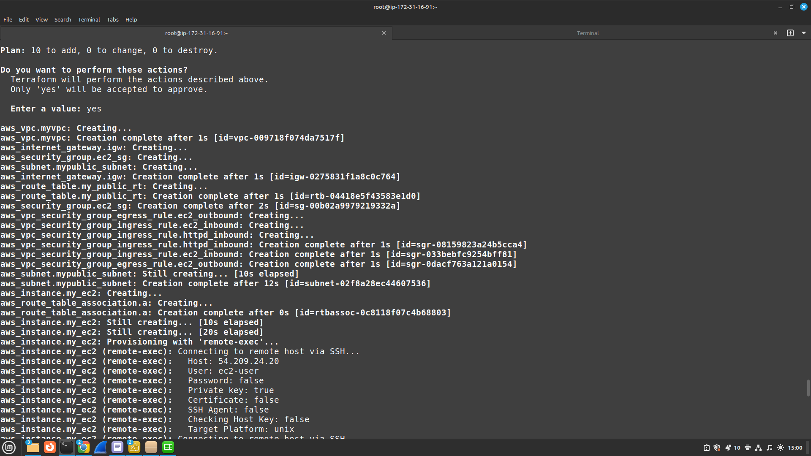
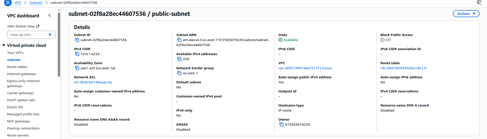
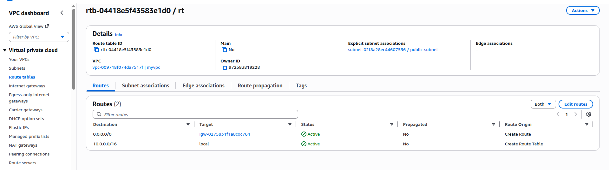
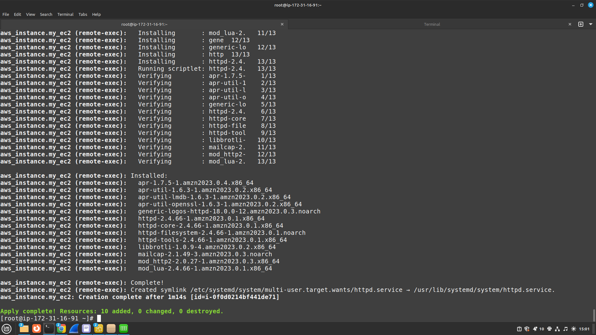
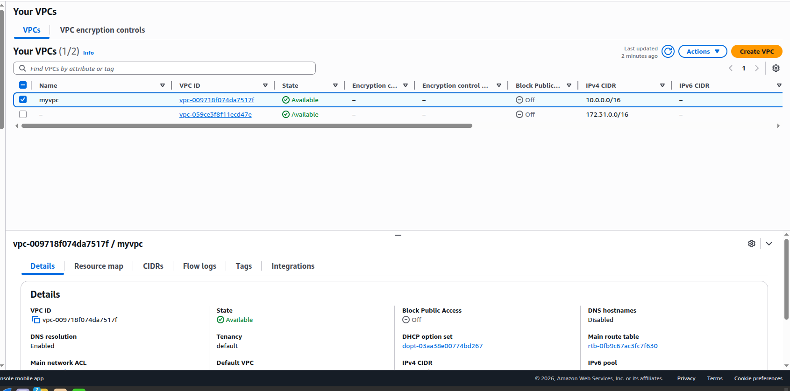
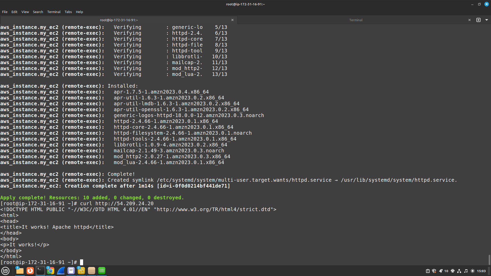
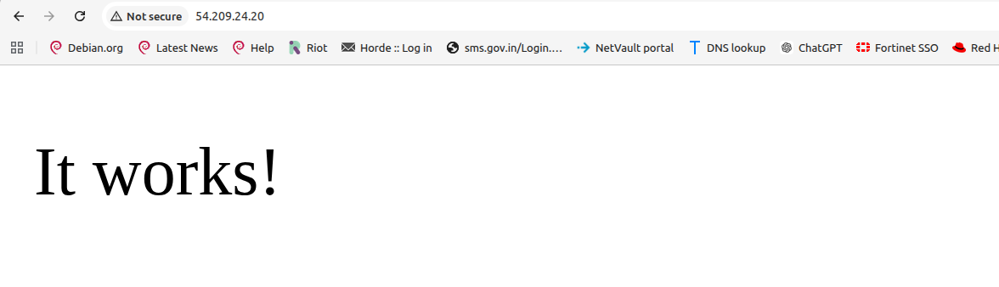

# Terraform AWS EC2 Apache Web Server Project
## 📸 Deployment Screenshots

### VPC Created


### Public Subnet


### Routing Table


### Terraform Apply & Provisioner Output


### Apply Complete


### HTTP Install Output


### Apache Working in Browser


##  Project Overview

This project demonstrates how to use **Terraform** to provision a 
basic AWS infrastructure and automatically configure a web server.

The infrastructure created in this project includes:

- **AWS VPC**
- **Public Subnet**
- **Internet Gateway (IGW)**
- **Route Table with Internet Route**
- **Route Table Association**
- **Security Group**
- **EC2 Instance**
- **Terraform Provisioner (`remote-exec`)**
- **Apache HTTP Server (`httpd`) installation**

After deployment, the EC2 instance becomes reachable over the internet 
and serves the default Apache web page (`It works!`).

---

#  Project Objective

The purpose of this project is to practice and understand:

- Basic **Infrastructure as Code (IaC)** using Terraform
- How to create a **custom AWS network**
- How to create a **public EC2 instance**
- How to allow **SSH** and **HTTP** access using Security Groups
- How to use **Terraform provisioners** to configure a server after it 
is created
- How to validate deployment by accessing the instance in a browser

This is a good **beginner-level DevOps / Cloud / Terraform lab project**.

---

#  Architecture

The following components are created in AWS:

1. **VPC**
    A custom Virtual Private Cloud to isolate our network resources.

2. **Public Subnet**
    A subnet inside the VPC that allows resources to have public IP addresses.

3. **Internet Gateway (IGW)**
    Attached to the VPC to provide internet access.

4. **Route Table**
    Contains a route (`0.0.0.0/0`) to the Internet Gateway.

5. **Route Table Association**
    Associates the public subnet with the route table so the subnet 
can use the internet route.

6. **Security Group**
    Controls traffic to and from the EC2 instance:
    - Port **22** for SSH
    - Port **80** for HTTP
    - All outbound traffic allowed

7. **EC2 Instance**
    An Amazon Linux EC2 instance launched in the public subnet.

8. **Provisioner (`remote-exec`)**
    Connects to the EC2 instance over SSH after creation and:
    - updates packages
    - installs Apache (`httpd`)
    - starts the service
    - enables it on boot

---

#  High-Level Flow

Terraform performs the following sequence:

1. Create a **VPC**
2. Create a **Public Subnet**
3. Create an **Internet Gateway**
4. Create a **Route Table**
5. Add route `0.0.0.0/0 → IGW`
6. Associate the route table with the subnet
7. Create a **Security Group**
8. Launch an **EC2 instance** in the public subnet
9. Connect to EC2 using SSH
10. Install and start **Apache HTTP server**
11. Access the public IP in a browser

---

#  Terraform Code

## `main.tf`

```hcl
provider "aws" {
   region = "us-east-1"
}

variable "myvpc_test" {
   default = "10.0.0.0/16"
}

resource "aws_vpc" "myvpc" {
   cidr_block = var.myvpc_test

   tags = {
     Name = "myvpc"
   }
}

resource "aws_subnet" "mypublic_subnet" {
   vpc_id                  = aws_vpc.myvpc.id
   cidr_block              = "10.0.1.0/24"
   map_public_ip_on_launch = true

   tags = {
     Name = "public-subnet"
   }
}

resource "aws_internet_gateway" "igw" {
   vpc_id = aws_vpc.myvpc.id

   tags = {
     Name = "myvpc_igw"
   }
}

resource "aws_route_table" "my_public_rt" {
   vpc_id = aws_vpc.myvpc.id

   route {
     cidr_block = "0.0.0.0/0"
     gateway_id = aws_internet_gateway.igw.id
   }

   tags = {
     Name = "public-rt"
   }
}

resource "aws_route_table_association" "a" {
   subnet_id      = aws_subnet.mypublic_subnet.id
   route_table_id = aws_route_table.my_public_rt.id
}

resource "aws_security_group" "ec2_sg" {
   name        = "ec2_sg"
   description = "Allow SSH and HTTP inbound traffic and all outbound traffic"
   vpc_id      = aws_vpc.myvpc.id
}

resource "aws_vpc_security_group_ingress_rule" "ec2_inbound" {
   security_group_id = aws_security_group.ec2_sg.id
   cidr_ipv4         = "0.0.0.0/0"
   from_port         = 22
   ip_protocol       = "tcp"
   to_port           = 22
}

resource "aws_vpc_security_group_ingress_rule" "httpd_inbound" {
   security_group_id = aws_security_group.ec2_sg.id
   cidr_ipv4         = "0.0.0.0/0"
   from_port         = 80
   ip_protocol       = "tcp"
   to_port           = 80
}

resource "aws_vpc_security_group_egress_rule" "ec2_outbound" {
   security_group_id = aws_security_group.ec2_sg.id
   cidr_ipv4         = "0.0.0.0/0"
   ip_protocol       = "-1"
}

resource "aws_instance" "my_ec2" {
   ami                    = "ami-02dfbd4ff395f2a1b"
   instance_type          = "t2.micro"
   subnet_id              = aws_subnet.mypublic_subnet.id
   key_name               = "office"
   vpc_security_group_ids = [aws_security_group.ec2_sg.id]

   connection {
     type        = "ssh"
     user        = "ec2-user"
     private_key = file("/home/your-username/.ssh/office.pem")
     host        = self.public_ip
   }

   provisioner "remote-exec" {
     inline = [
       "sudo yum update -y",
       "sudo yum install -y httpd",
       "sudo systemctl start httpd",
       "sudo systemctl enable httpd"
     ]
   }
}
```

---

#  Code Explanation (Detailed)

---

## 1. Provider Block

```hcl
provider "aws" {
   region = "us-east-1"
}
```

### Why this is needed

The **provider** tells Terraform which cloud platform or service it 
will manage.

In this project:

* Provider = **AWS**
* Region = **us-east-1**

### What it does

Terraform uses the AWS provider plugin to communicate with AWS APIs 
and create resources such as:

* VPC
* Subnet
* EC2
* Security Group
* Internet Gateway

### Important note

Without the provider block, Terraform does not know **where** or 
**how** to create infrastructure.

---

## 2. Variable Block

```hcl
variable "myvpc_test" {
   default = "10.0.0.0/16"
}
```

### Why this is needed

A **variable** allows us to avoid hardcoding values directly in 
multiple places.

### What it does

This variable stores the VPC CIDR block:

* `10.0.0.0/16`

### Why variables are useful

Variables improve:

* readability
* reusability
* maintainability

If the VPC CIDR changes later, we only change it in one place.

---

## 3. VPC Resource

```hcl
resource "aws_vpc" "myvpc" {
   cidr_block = var.myvpc_test

   tags = {
     Name = "myvpc"
   }
}
```

### Why this is needed

A **VPC (Virtual Private Cloud)** is the private network boundary for 
AWS resources.

### What it does

This creates a custom VPC with CIDR:

* `10.0.0.0/16`

### Why it is important

All networking resources in this project will be created inside this VPC:

* subnet
* route table
* internet gateway
* security group
* EC2 instance (through subnet)

### Why tags are added

Tags help identify resources in AWS Console.

---

## 4. Public Subnet Resource

```hcl
resource "aws_subnet" "mypublic_subnet" {
   vpc_id                  = aws_vpc.myvpc.id
   cidr_block              = "10.0.1.0/24"
   map_public_ip_on_launch = true

   tags = {
     Name = "public-subnet"
   }
}
```

### Why this is needed

A subnet divides the VPC into smaller IP ranges.

### What it does

Creates a subnet:

* inside the custom VPC
* with CIDR `10.0.1.0/24`

### Why `map_public_ip_on_launch = true` is important

This setting automatically assigns a **public IP** to instances 
launched in this subnet.

That is what makes this subnet behave like a **public subnet**.

### Why it matters

Without a public IP:

* Terraform `remote-exec` over SSH would fail
* You could not access Apache from your browser over the internet

---

## 5. Internet Gateway (IGW)

```hcl
resource "aws_internet_gateway" "igw" {
   vpc_id = aws_vpc.myvpc.id

   tags = {
     Name = "myvpc_igw"
   }
}
```

### Why this is needed

An **Internet Gateway** allows traffic between the VPC and the public 
internet.

### What it does

Attaches an IGW to the VPC.

### Why it is important

Without an IGW:

* instances cannot reach the internet
* the internet cannot reach public resources in the VPC

Even if the instance has a public IP, it still needs:

* IGW
* correct route table

---

## 6. Route Table

```hcl
resource "aws_route_table" "my_public_rt" {
   vpc_id = aws_vpc.myvpc.id

   route {
     cidr_block = "0.0.0.0/0"
     gateway_id = aws_internet_gateway.igw.id
   }

   tags = {
     Name = "public-rt"
   }
}
```

### Why this is needed

A route table controls **where traffic goes**.

### What it does

Adds a route:

* Destination: `0.0.0.0/0` → all IPv4 traffic
* Target: Internet Gateway

### Why it is important

This is what gives internet access to the subnet associated with this 
route table.

### Key concept

Public subnet = not just public IP
A subnet becomes truly “public” when:

* instance has public IP
* subnet uses a route table with `0.0.0.0/0 → IGW`

---

## 7. Route Table Association

```hcl
resource "aws_route_table_association" "a" {
   subnet_id      = aws_subnet.mypublic_subnet.id
   route_table_id = aws_route_table.my_public_rt.id
}
```

### Why this is needed

Creating a route table alone is **not enough**.

### What it does

Associates the public subnet with the public route table.

### Why it is important

Without this association:

* subnet will not use the route table
* internet route will not apply to the subnet
* EC2 in the subnet may not be reachable

This is a very common beginner mistake, so it is important to understand.

---

## 8. Security Group

```hcl
resource "aws_security_group" "ec2_sg" {
   name        = "ec2_sg"
   description = "Allow SSH and HTTP inbound traffic and all outbound traffic"
   vpc_id      = aws_vpc.myvpc.id
}
```

### Why this is needed

A Security Group acts like a **virtual firewall** for the EC2 instance.

### What it does

Creates a security group inside the VPC.

### Why it is important

This security group will control:

* what inbound traffic can reach the EC2 instance
* what outbound traffic the EC2 instance can send

---

## 9. Ingress Rule for SSH (Port 22)

```hcl
resource "aws_vpc_security_group_ingress_rule" "ec2_inbound" {
   security_group_id = aws_security_group.ec2_sg.id
   cidr_ipv4         = "0.0.0.0/0"
   from_port         = 22
   ip_protocol       = "tcp"
   to_port           = 22
}
```

### Why this is needed

Terraform `remote-exec` provisioner needs SSH access to connect to the 
instance.

### What it does

Allows inbound TCP traffic on:

* Port `22` (SSH)

From:

* `0.0.0.0/0` (anywhere)

### Why it is important

Without this rule:

* SSH connection fails
* provisioner fails
* manual SSH login also fails

### Security note

For lab/testing, `0.0.0.0/0` is acceptable.
In production, it is better to restrict SSH to:

* your office IP
* your home public IP
* a bastion host
* a VPN range

---

## 10. Ingress Rule for HTTP (Port 80)

```hcl
resource "aws_vpc_security_group_ingress_rule" "httpd_inbound" {
   security_group_id = aws_security_group.ec2_sg.id
   cidr_ipv4         = "0.0.0.0/0"
   from_port         = 80
   ip_protocol       = "tcp"
   to_port           = 80
}
```

### Why this is needed

Apache serves web pages on port **80** by default (HTTP).

### What it does

Allows inbound TCP traffic on:

* Port `80`

From:

* anywhere on the internet

### Why it is important

Without this rule:

* browser access to the public IP would fail
* `curl http://<public-ip>` from outside would fail

---

## 11. Egress Rule

```hcl
resource "aws_vpc_security_group_egress_rule" "ec2_outbound" {
   security_group_id = aws_security_group.ec2_sg.id
   cidr_ipv4         = "0.0.0.0/0"
   ip_protocol       = "-1"
}
```

### Why this is needed

Outbound traffic is required for the EC2 instance to communicate with 
external repositories and services.

### What it does

Allows **all outbound traffic** from the EC2 instance.

### Why it is important

Without outbound access, the following may fail:

* `yum update -y`
* `yum install -y httpd`

Because the server needs internet access to download packages.

---

## 12. EC2 Instance

```hcl
resource "aws_instance" "my_ec2" {
   ami                    = "ami-02dfbd4ff395f2a1b"
   instance_type          = "t2.micro"
   subnet_id              = aws_subnet.mypublic_subnet.id
   key_name               = "office"
   vpc_security_group_ids = [aws_security_group.ec2_sg.id]
```

### Why this is needed

This creates the virtual machine (server) in AWS.

### What it does

Launches an EC2 instance with:

* **AMI** = Amazon Linux
* **Instance Type** = `t2.micro`
* in the **public subnet**
* using the **security group**
* using an AWS **key pair** named `office`

### Why each line matters

#### `ami`

Specifies the operating system image.

#### `instance_type`

Defines CPU/RAM sizing.

#### `subnet_id`

Places the EC2 instance inside the public subnet.

#### `key_name`

Associates the AWS key pair with the instance for SSH access.

#### `vpc_security_group_ids`

Attaches the security group so the instance gets the firewall rules.

---

## 13. Connection Block

```hcl
connection {
   type        = "ssh"
   user        = "ec2-user"
   private_key = file("/home/your-username/.ssh/office.pem")
   host        = self.public_ip
}
```

### Why this is needed

The provisioner needs a way to log in to the EC2 instance.

### What it does

Defines SSH connection details:

* Protocol: SSH
* Username: `ec2-user`
* Private key: local `.pem` file
* Host: EC2 public IP

### Why `ec2-user`

Because this project uses **Amazon Linux**.

### Common usernames by OS

* Amazon Linux → `ec2-user`
* Ubuntu → `ubuntu`
* CentOS → `centos`
* RHEL → `ec2-user` or `root` depending on image

### Why `self.public_ip`

Terraform automatically uses the public IP assigned to the EC2 instance.

---

## 14. Provisioner (`remote-exec`)

```hcl
provisioner "remote-exec" {
   inline = [
     "sudo yum update -y",
     "sudo yum install -y httpd",
     "sudo systemctl start httpd",
     "sudo systemctl enable httpd"
   ]
}
```

### Why this is needed

This block performs configuration **after** the EC2 instance is created.

### What it does

Runs commands on the EC2 instance remotely over SSH.

### Commands explained

#### `sudo yum update -y`

Updates installed packages.

#### `sudo yum install -y httpd`

Installs Apache web server.

#### `sudo systemctl start httpd`

Starts the Apache service immediately.

#### `sudo systemctl enable httpd`

Ensures Apache starts automatically after reboot.

### Why it is important

Without this block:

* EC2 would be created
* but Apache would not be installed/configured automatically

This is the part that turns a raw server into a working web server.

---

#  Prerequisites

Before running this project, ensure the following are available:

* AWS account
* IAM user or role with permission to create:

   * VPC
   * Subnet
   * Internet Gateway
   * Route Table
   * Security Group
   * EC2
* Terraform installed
* AWS CLI configured (`aws configure`)
* Existing AWS EC2 key pair named:

```bash
office
```

* Local private key file exists:

```bash
/home/your-username/.ssh/office.pem
```

> The AWS key pair name and local private key file must match the key 
> used when creating the EC2 instance.

---

#  How to Run

## 1. Initialize Terraform

```bash
terraform init
```

### Why this is needed

Downloads the AWS provider plugin and initializes the working directory.

---

## 2. Validate Configuration

```bash
terraform validate
```

### Why this is needed

Checks whether the Terraform syntax is correct.

---

## 3. Preview the Plan

```bash
terraform plan
```

### Why this is needed

Shows what Terraform will create before actually creating resources.

---

## 4. Apply the Configuration

```bash
terraform apply
```

Type:

```bash
yes
```

when prompted.

### What happens during apply

Terraform will:

* create the infrastructure
* launch the EC2 instance
* connect via SSH
* install Apache
* start the Apache service

---

# ✅ Verification Steps

After successful apply:

## 1. Get the EC2 Public IP

Check AWS Console or use Terraform state/output.

## 2. Test from the EC2 instance

Example:

```bash
curl http://<public-ip>
```

Expected output:

```html
<title>It works! Apache httpd</title>
```

## 3. Test from browser

Open:

```bash
http://<public-ip>
```

Expected result:

* Apache default page
* **It works!**

---

# Deployment Result

This project was successfully validated with:

* `terraform apply` completed successfully
* `remote-exec` provisioner installed `httpd`
* `curl http://<public-ip>` returned Apache default HTML
* Browser displayed:

```text
It works!
```

This confirms:

* public networking is correct
* security group is correct
* route to internet is correct
* Apache is installed and running
* HTTP access is working

---

#  Important Notes / Common Issues

## 1. Wrong SSH Username

If the AMI is not Amazon Linux, `ec2-user` may fail.

Examples:

* Amazon Linux → `ec2-user`
* Ubuntu → `ubuntu`

---

## 2. Wrong Key Pair Name

`key_name` must match an **existing AWS key pair name** in the 
selected region.

```hcl
key_name = "office"
```

If the key pair does not exist in `us-east-1`, EC2 creation fails.

---

## 3. Wrong Local Private Key Path

Terraform reads the local private key file:

```hcl
private_key = file("/home/your-username/.ssh/office.pem")
```

If the file path is wrong, the provisioner fails.

---

## 4. Port 22 Not Open

If SSH is not allowed, Terraform cannot connect to the instance for 
`remote-exec`.

---

## 5. Port 80 Not Open

If HTTP is not allowed, Apache may be running but the browser will not 
load the page.

---

## 6. Route Table Not Associated

If the public subnet is not associated with the route table containing:

```text
0.0.0.0/0 → IGW
```

the instance may not have internet connectivity.

---


#  Learning Outcomes

By completing this project, the following Terraform and AWS concepts 
are practiced:

* Terraform provider configuration
* Variables
* Resource dependencies
* AWS VPC creation
* Public subnet creation
* Internet Gateway setup
* Route Table configuration
* Route Table association
* Security Group rules
* EC2 instance deployment
* SSH-based remote provisioning
* Apache installation and service management
* Basic web service validation

---

# Key Terraform Concepts Used

* **Provider** → connects Terraform to AWS
* **Variable** → stores reusable values
* **Resource** → creates infrastructure objects
* **Reference** → one resource uses another resource’s attributes
* **Dependency** → Terraform understands creation order automatically 
through references
* **Provisioner** → runs commands after resource creation
* **Connection Block** → tells Terraform how to connect to the instance

---

#  Conclusion

This project successfully demonstrates how to use Terraform to:

* provision AWS network infrastructure
* launch a public EC2 instance
* configure a web server automatically
* verify application accessibility through a browser

It is a strong **beginner DevOps / Terraform project** and a good 
foundation before moving to more production-friendly methods such as:

* **EC2 `user_data`**
* **Ansible**
* **Packer**
* **Terraform modules**

---


