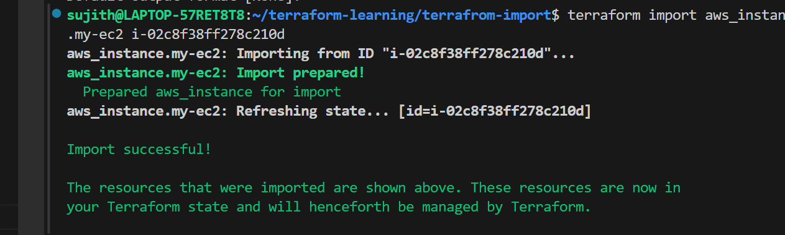
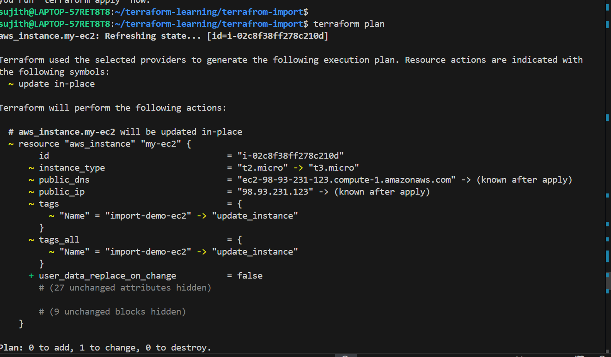
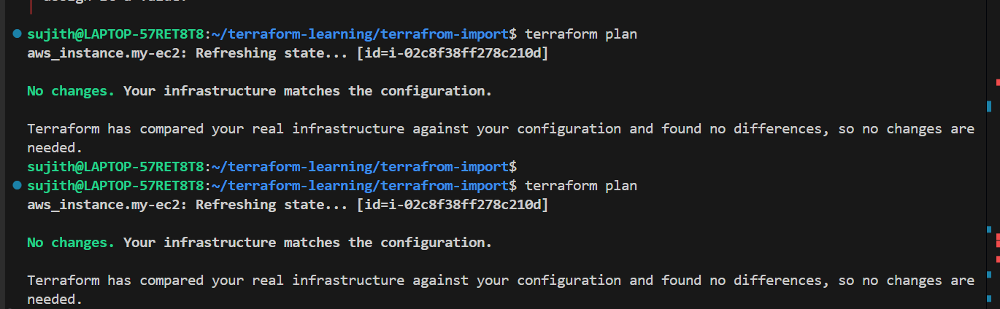

#  Terraform Import – Managing Existing AWS EC2

##  Project Overview

This project demonstrates how to **import an existing AWS EC2 instance into Terraform** and manage it using Infrastructure as Code.

---

##  Objective

* Import manually created EC2 instance into Terraform
* Understand Terraform state behavior
* Fix configuration drift
* Manage existing infrastructure using Terraform

---

##  Key Concept

> Terraform import does NOT create resources.
> It only adds existing infrastructure into Terraform **state file**.

---

##  Steps Performed

### 🔹 1. Create Empty Resource Block

```hcl
resource "aws_instance" "my-ec2" {
}
```

---

### 🔹 2. Run Import Command

```bash
terraform import aws_instance.my-ec2 i-02c8f38ff278c210d
```

---

### 🔹 3. Import Successful

Terraform added the resource into state:

```text
Import successful!
The resources that were imported are now in your Terraform state.
```

---

### 🔹 4. Initial Plan (Drift Detected)

```text
~ instance_type = "t2.micro" -> "t3.micro"
~ tags.Name     = "import-demo-ec2" -> "update_instance"
```

 Terraform detected difference between:

* State (actual AWS resource)
* Code (desired configuration)

---

### 🔹 5. Fix Configuration

Updated `main.tf`:

```hcl
resource "aws_instance" "my-ec2" {
  ami           = "ami-0c3389a4fa5bddaad"
  instance_type = "t3.micro"

  tags = {
    Name = "update_instance"
  }
}
```

---

### 🔹 6. Final Plan (No Drift)

```text
No changes. Your infrastructure matches the configuration.
```

---

##  Screenshots

### 🔹 Import Execution



---

### 🔹 Drift Detected (Before Fix)



---

### 🔹 Final State (After Fix)



---

##  What Happened Internally

```text
Existing EC2 → Imported to State → Compared with Code → Drift Fixed → Managed by Terraform
```

---

##  Important Learnings

* Import updates **state only**, not `.tf` code
* Terraform always treats **code as source of truth**
* Drift must be manually fixed in configuration
* `terraform plan` helps detect mismatches

---

##  Key Takeaways

* Successfully imported existing AWS EC2 into Terraform
* Understood state vs configuration difference
* Fixed drift between actual resource and code
* Terraform can now fully manage the resource

---

##  Commands Used

```bash
terraform init
terraform import aws_instance.my-ec2 <instance-id>
terraform plan
terraform apply
```

---

##  Real DevOps Use Case

* Migrating manual infrastructure to Terraform
* Bringing legacy systems under IaC
* Avoiding resource recreation


